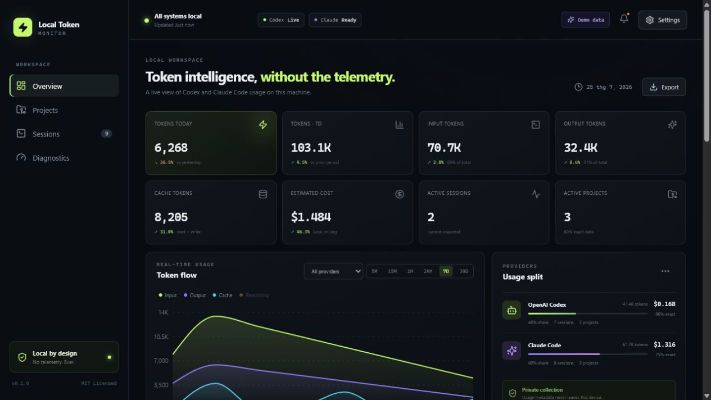

# Local Token Monitor

Local Token Monitor is a privacy-first dashboard for understanding token usage from OpenAI Codex CLI and Claude Code. It runs entirely on your machine at `http://localhost:3456`, stores usage metadata in SQLite, and never stores prompts, responses, source code, credentials, or API keys.



> **MVP status:** the application is usable today with Demo Mode and versioned fixture formats. Provider session formats are not stable public APIs; unsupported records are skipped safely and shown in Diagnostics.

## Features

- Detects installed and running Codex and Claude Code processes without changing them.
- Discovers recent JSON/JSONL session sources through provider-specific candidate paths.
- Separates input, output, cache read/write, reasoning, and total tokens.
- Shows the latest Codex usage-limit percentage and window when Codex reports it.
- Adds a **Third-party Providers** page for FreeModel, NTTCodex, and generic OpenAI/Anthropic-compatible services, with source, confidence, freshness, and strict `Unavailable` states.
- Labels every value as **Exact**, **Derived**, **Estimated**, or **Unavailable**.
- Links usage to projects when safe working-directory metadata is available.
- Live updates over Server-Sent Events, with time/provider/project filters.
- Project and session views, activity feed, diagnostics, privacy settings, retention, aliases, ignore controls, JSON/CSV export, and local reset.
- Isolated 30-day Demo Mode with three projects and both providers.
- Binds to `127.0.0.1` by default; no telemetry, analytics, cloud sync, or external font/image requests.

## One-command start

Requires Node.js 22.13 or newer.

```bash
npx local-token-monitor
```

No repository clone or global installation is required. The command downloads the package through npm when needed, starts the loopback-only server in the background, waits until it is healthy, prints Codex and Claude Code detection status, and opens [http://localhost:3456](http://localhost:3456). Live Data is the default; Demo Mode remains available in Settings.

Until the npm package is published, the public GitHub build works with the same one-command flow:

```bash
npx --yes github:phucthinhvn122/local-token-monitor
```

Only the first launch opens a browser tab. Re-running the command reuses the single background server; use `local-token-monitor open` when you intentionally want another tab.

For the GitHub build, stop or explicitly open it with:

```bash
npx --yes github:phucthinhvn122/local-token-monitor stop
npx --yes github:phucthinhvn122/local-token-monitor open
```

To stop it later:

```bash
npx local-token-monitor stop
```

Other commands:

```bash
npx local-token-monitor status
npx local-token-monitor open
npx local-token-monitor doctor
npx local-token-monitor export
npx local-token-monitor reset --yes
npx local-token-monitor provider discover freemodel
npx local-token-monitor provider discover nttcodex
npx local-token-monitor provider status
```

### Contributor development

```bash
git clone <repository-url>
cd local-token-monitor
npm install
npm run dev
```

Development uses the Vite UI on port 3456 and the loopback-only API on port 3457.

## How it works

1. Each provider adapter checks the CLI binary/version and a platform-specific list of candidate directories.
2. The read-only process scanner matches executable name, path, and redacted command metadata.
3. Versioned parsers extract only known usage fields from recent local session metadata. Unknown fields are ignored.
4. The normalizer prevents cache/reasoning fields from being added twice when a provider supplies an authoritative total.
5. SQLite deduplicates events with a SHA-256 fingerprint and aggregates the dashboard.
6. The browser subscribes to local SSE updates. There are no outbound application requests.

See [Architecture](docs/ARCHITECTURE.md) for module boundaries and the collection pipeline. Third-party quota support is documented in [Provider research](docs/THIRD_PARTY_PROVIDER_RESEARCH.md) and [Provider configuration](docs/THIRD_PARTY_PROVIDERS.md).

## Privacy

The app reads only candidate session/log formats required for usage extraction. It parses records in memory, keeps only usage metadata, and never persists message content. `.env` files are excluded from discovery. Command lines and diagnostics are redacted. Privacy Mode hides project paths, Git remotes, OS usernames, and full session identifiers.

Read [PRIVACY.md](PRIVACY.md) and [SECURITY.md](SECURITY.md) before enabling custom paths or non-loopback access.

## Supported data sources

| Provider | Source | Parser | Status |
|---|---|---|---|
| Codex | JSONL `token_count` / usage envelopes | `codex-usage-v1` | Defensive, fixture-tested |
| Claude Code | Assistant message `usage` metadata | `claude-message-usage-v1` | Defensive, fixture-tested |
| Both | Read-only process metadata | matcher v1 | Windows/macOS/Linux |
| Both | Local fallback estimator | UTF-8 byte heuristic | Disabled by default, always Estimated |
| FreeModel / NTTCodex | Public capability research | Level 0, no authentication | Verified domain; remaining quota unavailable without an official endpoint |
| Compatible APIs | Response rate-limit headers and usage bodies | Defensive JSON/SSE parser | User-configured, network off by default |

Exact support depends on provider versions and fields actually present. No token count is invented when metadata is absent.

## Current limitations

- Process CWD is restricted on some operating systems; a running process may remain an unresolved project until session metadata supplies a workspace path.
- WSL sources are not mounted or scanned automatically. Add an explicit readable custom path when appropriate.
- Codex/Claude session formats can change without notice. Unknown formats are skipped rather than guessed.
- Default pricing is a local, editable estimate with an effective date; the app never calls a pricing API automatically.
- FreeModel and NTTCodex do not currently expose a verified public quota/balance endpoint in the researched materials. The dashboard does not scrape authenticated pages or infer a balance.
- Collector setting changes and port changes currently take effect after restart.

## Adding a provider adapter

Implement the stable `ProviderAdapter` interface in a new `packages/provider-*` workspace. Keep discovery paths versioned, validate only known usage fields, redact parser errors, add synthetic fixtures, and never persist raw messages. Register the adapter with `CollectorManager`.

## Development

```bash
npm test
npm run lint
npm run build
npm run db:migrate
```

Please read [CONTRIBUTING.md](CONTRIBUTING.md). The roadmap is to expand verified provider fixtures, add safe WSL discovery, improve per-process CWD resolution, and publish signed cross-platform packages.

## License

[MIT](LICENSE) was chosen to keep reuse and contribution simple while preserving the standard warranty disclaimer.
